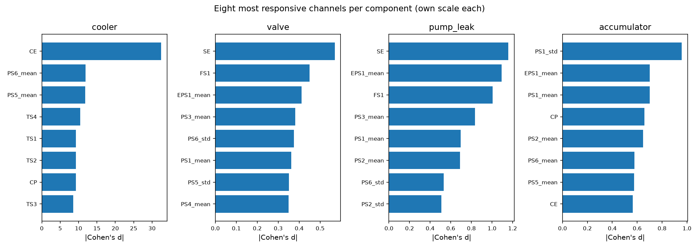
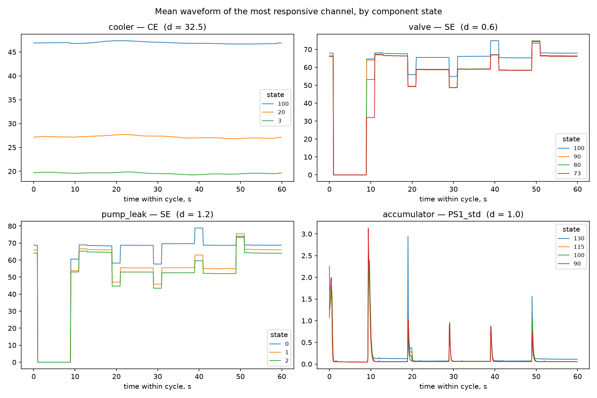

# ShopFloor

Industrial fault diagnosis: multi-output classification of hydraulic component
condition from raw sensor data, with a retrieval-augmented agent that explains the
diagnosis and cites the relevant maintenance procedure.

**Status:** week 3 of 13 — pipeline, features and random forest baselines done. A
convolutional model is next; the test set stays sealed until it is time to compare them.

## Data

[UCI 447 — Condition Monitoring of Hydraulic Systems](https://archive.ics.uci.edu/dataset/447/condition+monitoring+of+hydraulic+systems)
(Helwig, Pignanelli & Schütze, Saarland University, CC BY 4.0).

2205 cycles of 60 s from a hydraulic test rig. 17 sensors at three sampling rates:

| Sensors | Quantity | Unit | Rate | Points per cycle |
|---|---|---|---|---|
| PS1–PS6 | pressure | bar | 100 Hz | 6000 |
| EPS1 | motor power | W | 100 Hz | 6000 |
| FS1, FS2 | volume flow | l/min | 10 Hz | 600 |
| TS1–TS4 | temperature | °C | 1 Hz | 60 |
| VS1 | vibration | mm/s | 1 Hz | 60 |
| CE, CP, SE | cooling efficiency, cooling power, efficiency factor | %, kW, % | 1 Hz | 60 |

Four components are graded independently:

| Component | States | Healthy cycles |
|---|---|---|
| Cooler | 100% / 20% / 3% | 741 (34%) |
| Valve | 100 / 90 / 80 / 73 | 1125 (51%) |
| Pump leakage | none / weak / severe | 1221 (55%) |
| Accumulator | 130 / 115 / 100 / 90 bar | 599 (27%) |
| **All four at once** | — | **21 (0.95%)** |

## Why supervised classification, not anomaly detection

Only 21 of 2205 cycles are healthy in all four components — 10 if the stable flag
is also required. The rig was run as a factorial experiment across 3 × 4 × 3 × 4 =
144 fault combinations at roughly 15 cycles each, so a "normal" population was
never collected. Reconstruction-based anomaly detection has nothing to train on.

The supervised framing is also the more useful one here: the output is a
diagnosis ("valve at 80 — severe lag, pump leaking weakly") rather than an alarm,
which is what the downstream agent needs in order to retrieve the right procedure.
Severity grades give prioritisation: 90 means schedule it, 73 means stop now.

An autoencoder is planned as a second layer for faults outside the four known
components — a classifier for what is known, an anomaly detector for the rest.

## Sampling rates

`make tensor` reconciles the three rates into one array of shape
`(2205, 24, 600)`, float32, 127 MB — down from roughly 3 GB as Python lists.

The target is 10 Hz, the middle of the three rates. Downsampling everything to
1 Hz was rejected: valve faults are switching-lag faults measured in
milliseconds, and 1 Hz destroys exactly that signal. Keeping 100 Hz would have
produced a 1.3 GB tensor for no gain on the slow channels.

17 sensors become 24 channels:

- **100 Hz** — each cycle is reshaped into 600 blocks of 10 samples, and both the
  block **mean** and the block **standard deviation** are kept. Plain decimation
  would discard the within-block ripple; the std channel preserves it in one
  number per block. Seven sensors, fourteen channels.
- **10 Hz** — passed through unchanged. Two channels.
- **1 Hz** — each reading repeated ten times rather than interpolated, since the
  sensor genuinely did not measure in between and interpolation would invent
  values. Eight channels.

The std channels were not free insurance: `PS1_std` turns out to be the single
most responsive channel for accumulator wear (see below).

## What the sensors say

`make eda` scores every channel against every component by the standardised
difference (Cohen's *d*) between healthy cycles and the most degraded ones, using
the cycle-wide mean of each channel.

| Component | Most responsive channels | *d* |
|---|---|---|
| Cooler | CE, PS6_mean, PS5_mean, TS4, TS1 | 32.5 · 11.9 · 11.9 · 10.5 · 9.3 |
| Valve | SE, FS1, EPS1_mean, PS3_mean, PS6_std | 0.57 · 0.45 · 0.41 · 0.38 · 0.38 |
| Pump leakage | SE, EPS1_mean, FS1, PS3_mean, PS1_mean | 1.16 · 1.09 · 1.00 · 0.83 · 0.70 |
| Accumulator | PS1_std, EPS1_mean, PS1_mean, CP, PS2_mean | 0.96 · 0.70 · 0.70 · 0.66 · 0.65 |



Three findings shape the modelling that follows.

**The accumulator is diagnosed by ripple, not by level.** Its job is to damp
pressure pulsations, so a worn one shows up as increased variability rather than
a shifted mean — which is why `PS1_std` leads and `PS1_mean` trails it. This
channel exists only because the resampling step kept block standard deviations.

**CE, CP and SE are computed, not measured.** The dataset marks CE and CP as
*virtual*, and SE is an efficiency factor derived the same way. `CE` is literally
cooling efficiency in percent — using it to predict cooler condition is close to
circular, and its *d* of 32.5 (three perfectly separated bands, no overlap) says
so. This is not label leakage in the strict sense, since the value is available
at inference time, but it makes one of the four tasks trivial and hides whether
the model learned anything. **Every result is therefore reported twice: with and
without the three virtual channels.**

**Cycle-wide averages are the wrong summary.** The valve scores *d* = 0.57 at
best, which reads as "barely detectable" — but the waveform plot shows the four
severity levels diverging sharply during the switching transients at 9–11 s and
19–21 s, and running together the rest of the time. Two informative seconds are
being diluted across sixty. The same holds for the accumulator, whose `PS1_std`
signal is concentrated in pulsation spikes at 20 s and 50 s. Features must
therefore be computed over windows, not over whole cycles — and this is the
argument for the convolutional model, which locates the informative window
itself.



## Splitting

Two obvious splits are both wrong here, and neither announces itself.

**Chronological fails.** Cooler condition was varied in one long block: the first ~1460
cycles cover the two faulty grades and the rest is healthy. A 70/15/15 split by time
leaves a single class in validation and test, so the cooler cannot be evaluated at all.

**Random leaks.** The rig held one of 144 configurations fixed for a stretch of cycles —
ten on average, up to 210. Neighbouring cycles inside a block are near-duplicates: same
fault, same operating point, minutes apart. Splitting by cycle scores the model for
recognising a run it has already seen.

So the unit of splitting is the **run** — a contiguous block of identical configuration.
194 of them, assigned whole. A configuration in validation therefore never appears in
training, which means the model has to generalise to an unseen *combination* of faults.
That is the deployment case, and it is a stricter test than stratification alone.

One consequence is worth stating: `seed = 42` produces a split with **no
"close to total failure" valve cycles in the test set** — 21 of 200 seeds do. Nothing
about that fails loudly; the code runs, the metrics compute, the report looks convincing.
`split_by_run` therefore validates class coverage and raises rather than returning a
split that quietly cannot measure what matters. `split_seed` defaults to the first seed
that passes.

## Baseline results

`make baseline` trains one random forest per component on the 864 windowed features,
twice — with all 24 channels, and with the three virtual ones removed. **Scored on
validation.** The test set is spent the moment it is looked at more than once, so it
stays closed until the final model comparison.

| Component | channels | macro F1 | accuracy | FAR | MAR |
|---|---|---|---|---|---|
| Cooler | all | 1.000 | 1.000 | 0.000 | 0.000 |
| Cooler | measured | 0.993 | 0.993 | 0.000 | 0.000 |
| Valve | all | 0.987 | 0.986 | 0.010 | 0.011 |
| Valve | measured | 0.980 | 0.980 | 0.010 | 0.011 |
| Pump leakage | all | 0.996 | 0.997 | 0.008 | 0.000 |
| Pump leakage | measured | 0.996 | 0.997 | 0.008 | 0.000 |
| Accumulator | all | 0.917 | 0.935 | 0.111 | 0.000 |
| Accumulator | measured | 0.847 | 0.871 | 0.125 | 0.014 |

Validation is 294 cycles, so one misclassified cycle moves accuracy by 0.34 %. Read the
sub-1-point differences as noise.

### The virtual channels matter less than expected — except in one place

Removing CE, CP and SE costs the cooler 0.7 points, which is **two cycles**. The concern
was worth measuring and the measurement says the dependence is negligible: CE is derived
from oil temperature, and the temperature channels are still there, so nothing is lost.
The pump loses nothing at all.

The accumulator is the exception — 6.4 points, about 19 cycles. That is the opposite of
what the effect-size ranking suggested, where the cooler looked most exposed. Reported
both ways precisely because the guess would have been wrong.

### The forests rely on the channels the exploratory analysis identified

| Component | Most important features | Matches |
|---|---|---|
| Cooler | `TS4_w5_p25`, `PS5_mean_w5_p75`, `PS6_mean_w5_max` | temperatures and the cooling-circuit pressures |
| Valve | `PS2_mean_w0_std`, `PS2_mean_w0_mean`, `PS3_mean_w0_mean` | **window `w0`** — the switching transient at 9–11 s |
| Pump leakage | `FS1_w5_mean`, `FS1_w4_p25`, `FS1_w5_min` | volume flow, which a leak reduces directly |
| Accumulator | `FS1_w3_std`, `PS1_std_w0_std`, `PS1_std_w0_max` | **four of five are spread, not level** |

Two independent confirmations fall out of this. The valve's features come from the exact
window where the waveforms diverged, which justifies windowing by *what* the model chose
rather than only by the metric improving. And the accumulator leans on the block standard
deviation invented during resampling — including the spread of the spread — which is the
strongest possible argument for having kept it.

### Errors follow the severity ordering, and never in the expensive direction

Cooler, valve and pump make 2, 6 and 1 mistakes respectively, every one of them between
**neighbouring** grades. Severe pump leakage is caught 111 times out of 111.

The accumulator makes 38, and a quarter of them jump a grade:

```
true \ pred   90  100  115  130
       90    64    7    9    0
      100     6   22    3    0
      115     1    0  107    3
      130     0    0    9   63
```

| Distance in the ordering 90 < 100 < 115 < 130 | Errors |
|---|---|
| Neighbouring | 28 |
| One grade skipped (90 ↔ 115) | 10 |
| Two or more skipped | 0 |

But look at where the errors sit rather than how many there are. The `130` column is zero
for rows `90` and `100`: a badly degraded accumulator is **never** called healthy. All
three misses are `115 → 130`, the mildest degradation read as healthy. All nine false
alarms are `130 → 115`, healthy read as the mildest degradation.

The errors are not merely rare, they are displaced towards the safe side. Macro F1 of
0.847 reads as mediocre; the matrix says the grade is occasionally off by one while the
alarm itself is always right. For a maintenance engineer those are two different reports,
which is why both are printed.

### What the baseline implies for the neural network

Three of four components sit between 0.980 and 0.996 on 294 validation cycles. There is
no room left to beat, so a convolutional model has to be justified differently:

1. **The accumulator**, where 0.847 leaves real headroom, and where the failure is
   localised to the `90 ↔ 115` pair plus the rare `100` grade (31 cycles bleeding both
   ways).
2. **No hand-crafted features.** Reaching the same quality from the raw signal, without
   the 864 columns we designed, is a result in itself.
3. **The accumulator's false-alarm rate of 0.125** — one healthy unit in eight sent for
   service — is the worst operational number in the table.

Cheaper hypotheses come first, though: more windows (the accumulator's pulsation spikes
are shorter than a 10 s window), balanced class weights, and features aimed at the shape
of the spike rather than its average.

## Quick start

```
git clone https://github.com/OlenaP94/shopfloor && cd shopfloor
uv sync
make data      # downloads and validates 73 MB from UCI
make tensor    # resamples 17 sensors into a 24-channel tensor
make features  # 864 windowed features
make split     # shows the split and its class coverage
make baseline  # trains the forests, scores them on validation
make eda       # scores every channel against every fault
make check     # format, lint, tests
```

## Layout

```
src/shopfloor/data.py       readers for the sensor matrices and profile labels
src/shopfloor/dataset.py    HydraulicDataset — validated access to one experiment
src/shopfloor/arrays.py     resampling to one (cycles, channels, timepoints) tensor
src/shopfloor/features.py   windowed features, 864 columns from 24 channels
src/shopfloor/splits.py     run-aware train/val/test split with coverage checks
src/shopfloor/metrics.py    confusion matrix, macro F1, alarm rates — no sklearn
src/shopfloor/baseline.py   random forests per component, scored on validation
src/shopfloor/config.py     settings, read from the environment or .env
scripts/download_data.py    download, checksum and structural validation
scripts/eda.py              which channels respond to which fault
reports/figures/            plots, regenerated by `make eda`
reports/baseline_val.txt    the table and matrices above, regenerated by `make baseline`
tests/                      unit tests, no dataset required
```

`metrics.py` is deliberately written from the confusion matrix up rather than imported.
`tests/test_metrics_vs_sklearn.py` then checks it against scikit-learn over randomised
class distributions — which found a case the hand-written tests could not: an undefined
false-alarm rate was being reported as 0.0, making "no false alarms" and "false alarms
could not be measured" look identical.

## Licence

Apache-2.0. See `NOTICE`.

Dataset: Helwig, N., Pignanelli, E., & Schütze, A. (2015). *Condition monitoring
of hydraulic systems* [Dataset]. UCI Machine Learning Repository.
<https://doi.org/10.24432/C5CW21>
